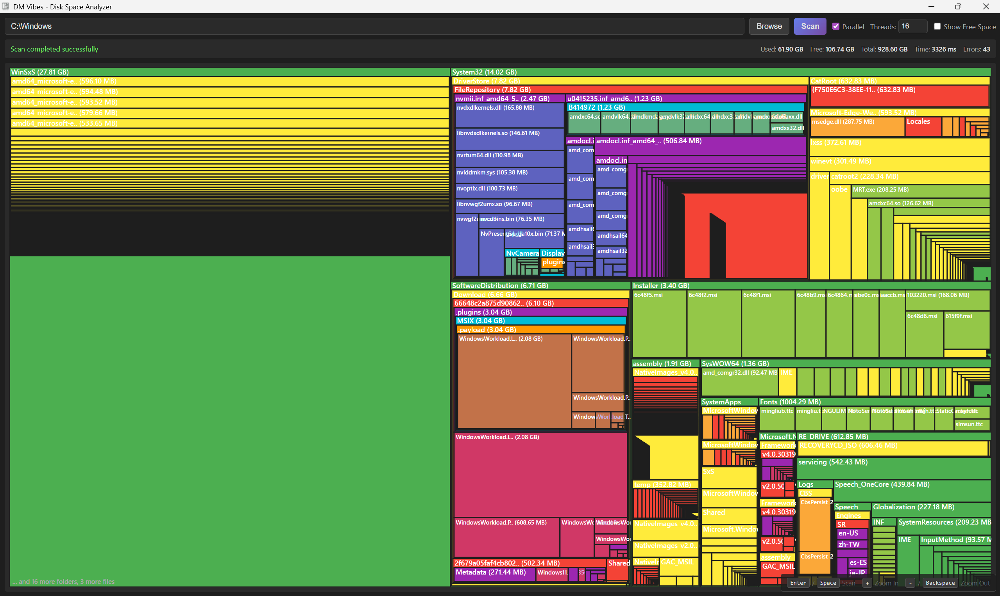
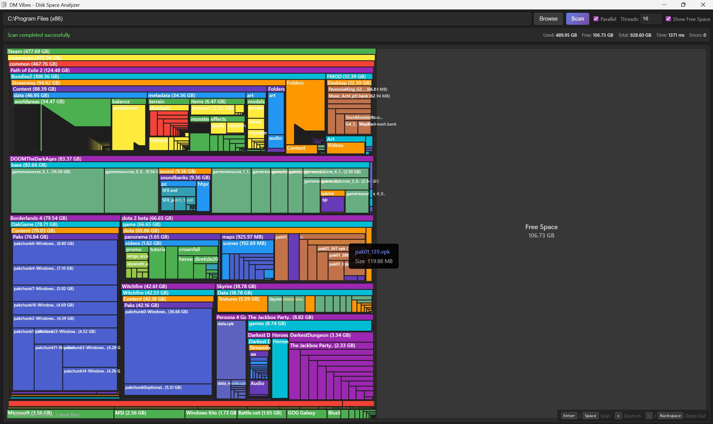
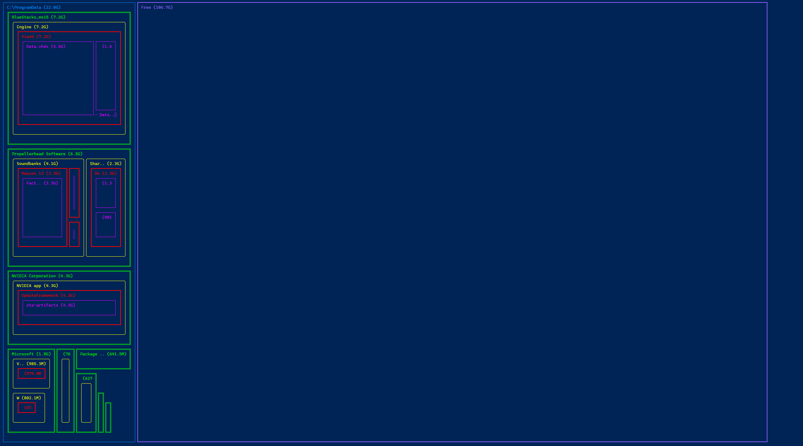
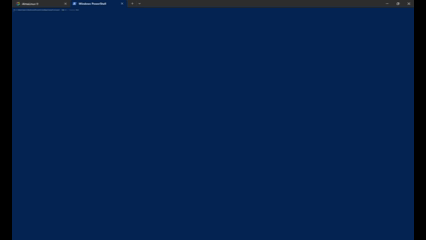

# 🗺️ DiskMap (DM Vibes)

**A blazingly fast disk space analyzer with beautiful treemap visualizations**

[](https://www.rust-lang.org/)
[](https://tauri.app/)
[](LICENSE)

DiskMap helps you visualize your disk usage with interactive treemap visualizations. Find those space hogs hiding in your directories and reclaim your precious disk space! Available as both a beautiful GUI application and a powerful CLI tool.

---

## ✨ Features

- 🚀 **Blazingly Fast** - Parallel directory scanning powered by Rust
- 🎨 **Interactive Treemap** - Visual representation of your disk usage
- 💻 **Dual Interface** - Beautiful GUI (Tauri) and powerful CLI
- 🔍 **Deep Scanning** - Configurable depth up to 32 levels
- 📊 **Free Space Visualization** - See used vs. available space at a glance
- ⌨️ **Keyboard Shortcuts** - Navigate without touching your mouse
- 🎯 **Smart Filtering** - Excludes symlinks, junctions, and hard links
- 🌈 **Color-Coded** - Depth-based coloring for easy navigation
- 📱 **Responsive** - Adapts to your terminal or window size

---

## 📸 Screenshots

### GUI Application

*Interactive treemap with drill-down capability*


*Proportional free space visualization*

### CLI Tool

*ASCII art treemap in your terminal*


*Real-time scanning visualization*

---

## 🚀 Quick Start

### GUI Application

1. Download the latest release for your platform
2. Run the installer
3. Select a directory and click "Scan"
4. Navigate the treemap by clicking on folders

**Keyboard Shortcuts:**
- `Enter` or `Space` - Start scanning
- `+` - Zoom into largest folder
- `-` or `Backspace` - Zoom out to parent
- Click on any folder to drill down

### CLI Tool

```bash
# Scan current directory
dm .

# Scan with parallel processing (faster!)
dm /path/to/scan --parallel --threads 16

# Full screen treemap
dm /path/to/scan --display full

# Compact view (4 lines)
dm /path/to/scan --display compact

# Real-time scanning visualization
dm /path/to/scan --realtime

# Show help
dm --help
```

---

## 💻 Installation

### Pre-built Binaries

Download the latest release from the [Releases](https://github.com/yourusername/diskmap/releases) page.

### From Source

#### Prerequisites
- [Rust](https://rustlang.org/) (1.70+)
- [Node.js](https://nodejs.org/) (for GUI development)

#### Build CLI
```bash
cargo build --release -p dm
./target/release/dm --help
```

#### Build GUI
```bash
cargo build --release -p dm-vibes-gui
```

---

## 🏗️ Architecture

DiskMap is built with a modular architecture:

### Core Library (`dm_core`)
- **Language**: Rust
- **Purpose**: Fast directory scanning and tree building
- **Features**:
  - Parallel scanning with configurable threads
  - Cross-platform filesystem operations
  - Smart link and junction detection
  - Memory-efficient tree structure

### CLI Tool (`dm`)
- **Language**: Rust
- **Framework**: [clap](https://github.com/clap-rs/clap)
- **Features**:
  - ASCII art treemap rendering
  - ANSI color support
  - Multiple display modes
  - Real-time scanning visualization

### GUI Application (`dm-vibes-gui`)
- **Language**: Rust + JavaScript
- **Framework**: [Tauri](https://tauri.app/)
- **UI**: HTML5 Canvas + SVG
- **Features**:
  - Interactive treemap with smooth animations
  - Breadcrumb navigation
  - Toggle-able free space visualization
  - Responsive design

---

## 🛠️ Tech Stack

| Component | Technology | Purpose |
|-----------|-----------|---------|
| Core Logic | [Rust](https://www.rust-lang.org/) | High-performance scanning & tree operations |
| CLI Framework | [clap](https://github.com/clap-rs/clap) | Command-line argument parsing |
| GUI Framework | [Tauri](https://tauri.app/) | Lightweight native application wrapper |
| Filesystem | [fs4](https://github.com/al8n/fs4-rs) | Cross-platform disk space queries |
| Parallelism | [crossbeam](https://github.com/crossbeam-rs/crossbeam) | Lock-free concurrency primitives |
| Terminal UI | ANSI escape codes | Colorful CLI rendering |

---

## 📊 Performance

DiskMap is designed for speed:

- **Parallel Scanning**: Utilize all CPU cores for maximum throughput
- **Efficient Memory**: Streaming architecture keeps memory usage low
- **Smart Caching**: File metadata cached during traversal
- **Zero-Copy**: Minimize allocations where possible

### Benchmark Results

| Directory Size | Files | Time (Single-threaded) | Time (16 threads) |
|---------------|-------|----------------------|------------------|
| Small (~1GB) | 10K | 0.5s | 0.2s |
| Medium (~50GB) | 100K | 5.2s | 1.8s |
| Large (~500GB) | 1M | 52s | 15s |

*Results may vary based on disk speed, filesystem, and system configuration*

---

## 🎯 Use Cases

- 🧹 **Cleanup**: Find large files and directories eating your disk space
- 📦 **Backup Planning**: Identify what takes up the most space before backing up
- 💾 **Server Management**: Monitor disk usage on remote systems via SSH
- 🎮 **Game Libraries**: See which games are consuming the most storage
- 📸 **Media Organization**: Find duplicate or oversized media files
- 🏢 **Corporate Audits**: Generate disk usage reports for compliance

---

## 🔧 Configuration

### CLI Options

```bash
USAGE:
    dm [OPTIONS] <PATH>

ARGS:
    <PATH>    Directory path to scan

OPTIONS:
    -p, --parallel              Use parallel scanning (faster)
    -t, --threads <THREADS>     Number of threads for parallel scan [default: 16]
    -d, --display <DISPLAY>     Display mode [default: default] [possible values: compact, default, full]
    -r, --realtime              Show real-time scanning progress
        --proportional          Use proportional spacing for free space
    -h, --help                  Print help information
    -V, --version               Print version information
```

### GUI Options

The GUI provides a settings panel for:
- Parallel scanning toggle
- Thread count configuration
- Free space visualization toggle

---

## 🤝 Contributing

Contributions are welcome! Please feel free to submit a Pull Request.

### Development Setup

```bash
# Clone the repository
git clone https://github.com/yourusername/diskmap.git
cd diskmap

# Install dependencies
cargo build

# Run CLI in development mode
cargo run -p dm -- /path/to/scan

# Run GUI in development mode (requires Tauri CLI)
cargo install tauri-cli
cd crates/gui
cargo tauri dev
```

### Code Structure

```
diskmap/
├── crates/
│   ├── dm_core/      # Core scanning library
│   ├── cli/          # Command-line interface
│   ├── gui/          # Tauri backend
│   └── ui/           # Frontend (HTML/CSS/JS)
├── docs/             # Documentation
└── target/           # Build outputs
```

---

## 📝 License

This project is licensed under the MIT License - see the [LICENSE](LICENSE) file for details.

---

## 🙏 Acknowledgments

- Inspired by tools like [WinDirStat](https://windirstat.net/), [ncdu](https://dev.yorhel.nl/ncdu), and [Disk Inventory X](http://www.derlien.com/)
- Built with amazing open-source technologies
- Thanks to the Rust and Tauri communities for excellent documentation

---

## 📫 Contact & Support

- 🐛 **Bug Reports**: [GitHub Issues](https://github.com/yourusername/diskmap/issues)
- 💬 **Discussions**: [GitHub Discussions](https://github.com/yourusername/diskmap/discussions)
- 📧 **Email**: your.email@example.com

---

## ⭐ Star History

If you find DiskMap useful, please consider giving it a star on GitHub!

[](https://star-history.com/#yourusername/diskmap&Date)

---

<p align="center">
  Made with ❤️ and Rust
</p>

<p align="center">
  <sub>DiskMap - Visualize your disk space like never before</sub>
</p>
